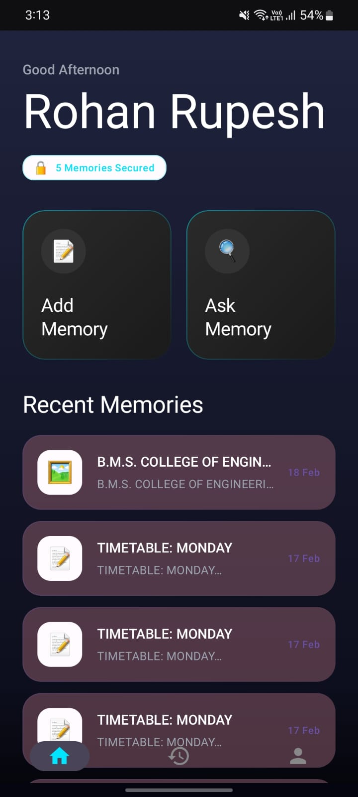
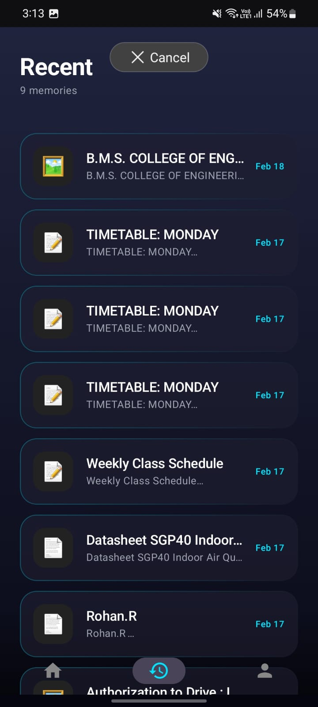
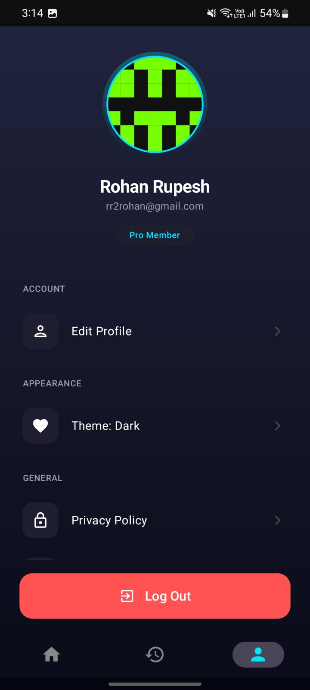
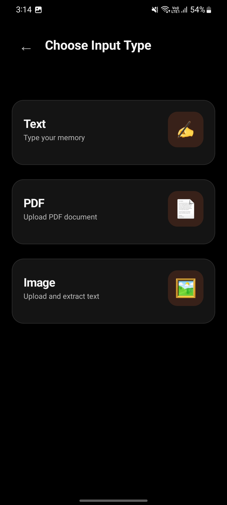
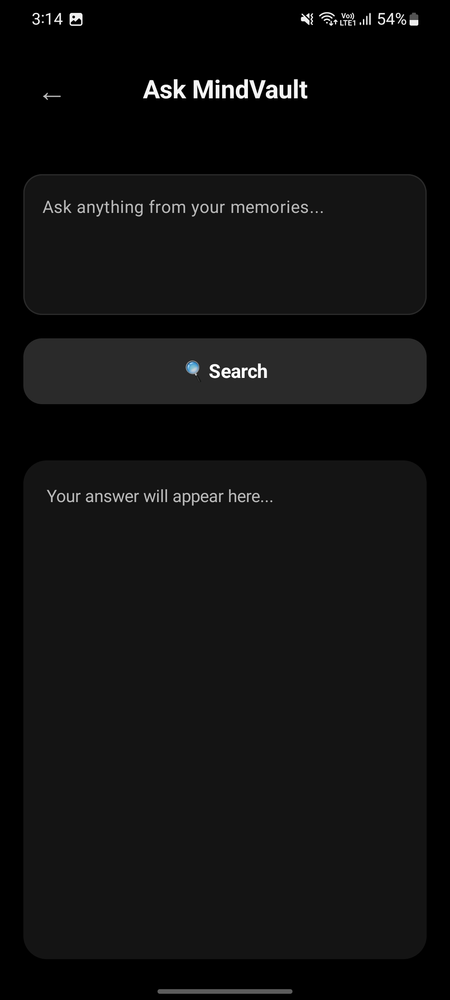

# 🧠 MindVault

MindVault is a personal knowledge management demo with two interfaces:

- A web demo for storing and querying information  
- A Kotlin Android app for mobile interaction  

The project focuses on **concept validation, UI behavior, and learning outcomes**.

---

## 🚀 Overview

MindVault demonstrates a simple retrieval workflow:

1. Store information  
2. Ask questions in natural language  
3. Receive AI-generated responses from stored context  

During development demos, the web interface was exposed using **ngrok**.

---

## ✨ Key Features

- Data capture and retrieval demo flow  
- Simple AI-assisted query interface  
- Android client prototype in Kotlin (Activity + XML)  
- Clean UI-first approach for rapid iteration  

---

## 📸 Screenshots

### 🌐 Web UI

  

---

### 📱 Android UI

  
  
  
  

---

## 📱 Android App Scope

The Android module is intentionally lightweight and built to validate client-side UX:

- Kotlin + Android SDK  
- Activity-based navigation  
- XML layouts  
- Basic interaction/testing screens  

---

## 📌 Project Scope and Limits

This repository intentionally does **not include**:

- Internal backend / AI workflow details  
- Production deployment setup  
- Sensitive service configuration  

---

## 🛠️ Local Run Guidance

### 📱 Android

1. Open the repository in Android Studio  
2. Sync Gradle dependencies  
3. Run on emulator/device  

---

### 🌐 Web Demo

The original web demo setup is not fully packaged in this repository.

To reproduce a similar flow:

1. Run a local web frontend  
2. Connect your own AI service endpoint  
3. Optionally expose locally using ngrok  

---

## 🔐 Security

- No credentials should be committed  
- Keep secrets in local environment/config only  
- Use sanitized or non-personal test data  

---

## 🤝 Contributing

Contributions are welcome for:

- UI improvements  
- Documentation clarity  
- Code organization  

Please avoid adding:
- Secrets  
- Internal service credentials  
- Private workflow details  

---

## 📬 Support

- [Android Developers](https://developer.android.com/docs)  
- [ngrok Docs](https://ngrok.com/docs)  
- GitHub Issues in this repository  
